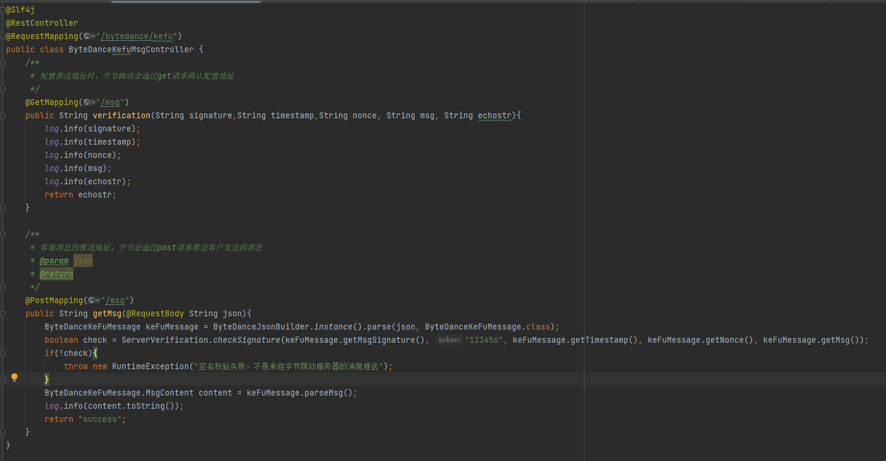
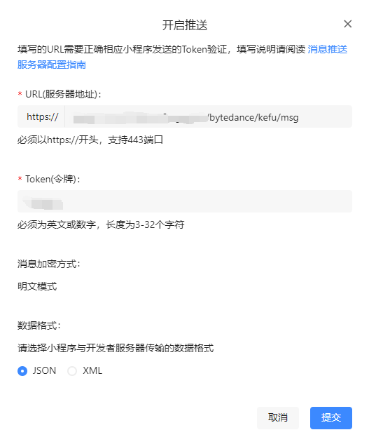

# ByteDance
- 目前这个仓库是封装[小程序服务端API](https://microapp.bytedance.com/docs/zh-CN/mini-app/develop/server/server-api-introduction)
- 未来[现有的第三方平台sdk](https://github.com/yydzxz/ByteDanceOpen)也会作为一个模块加入这个仓库

### 客户消息
#### 创建接收客户消息的controller
1. 两个接口地址是一样的。
2. get接口，用于后面在字节小程序后台配置客户消息推送地址的时候，接收字节的确认请求
3. post接口，用于接收字节推送过来的 客户发送的消息
   
#### 配置客户消息推送地址
1. token要记住，配置完毕就不能查看了

